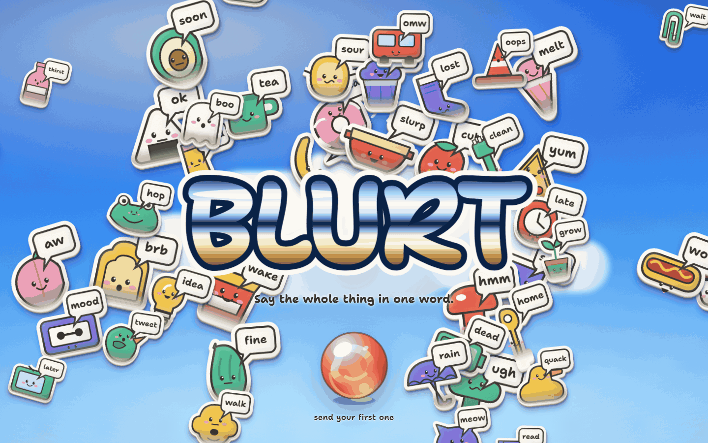
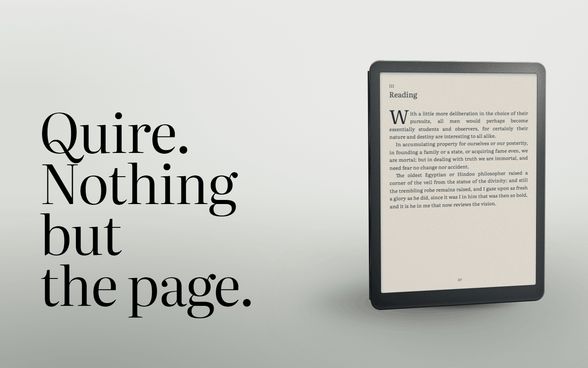
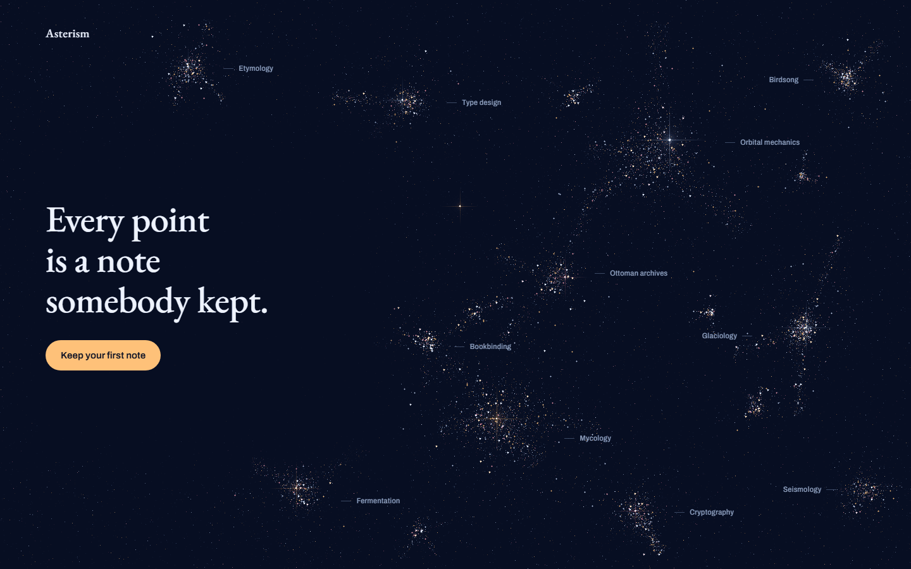
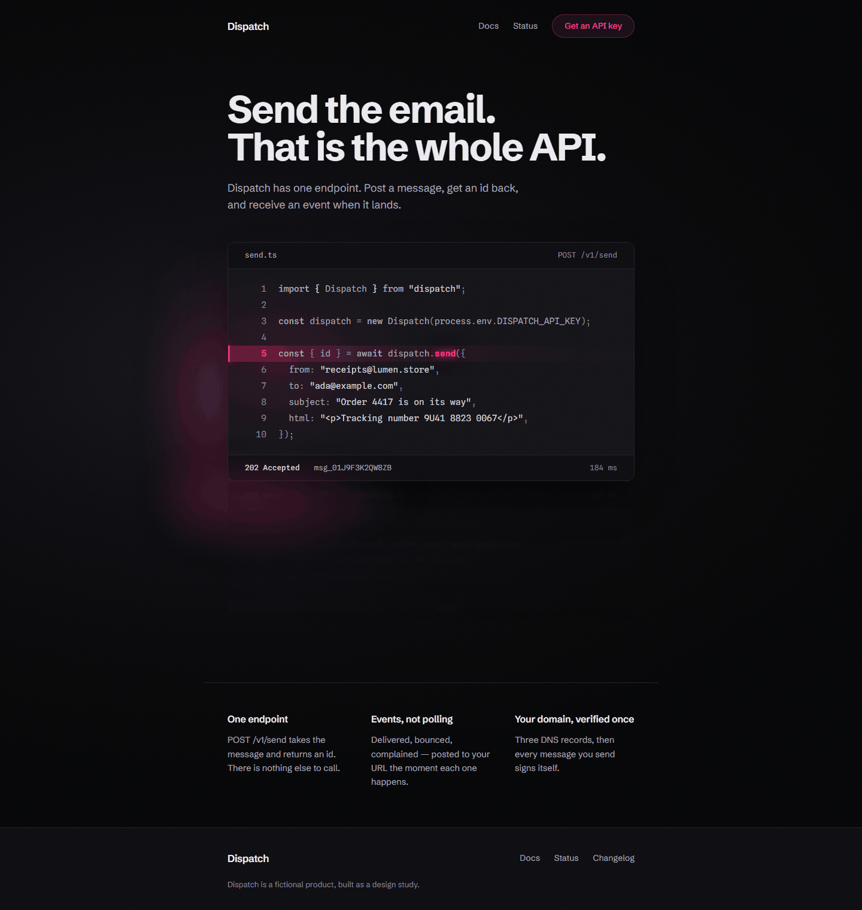
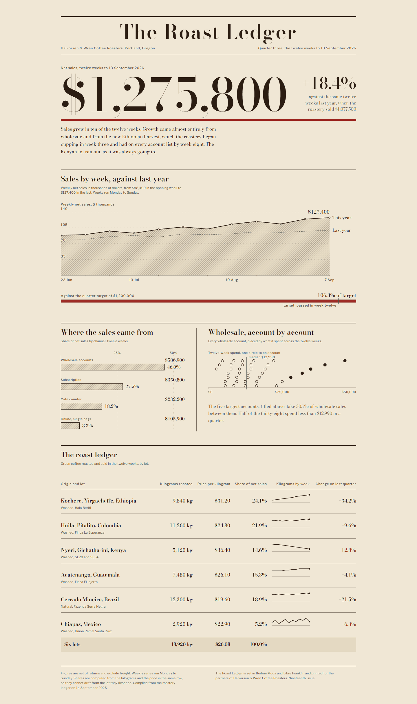
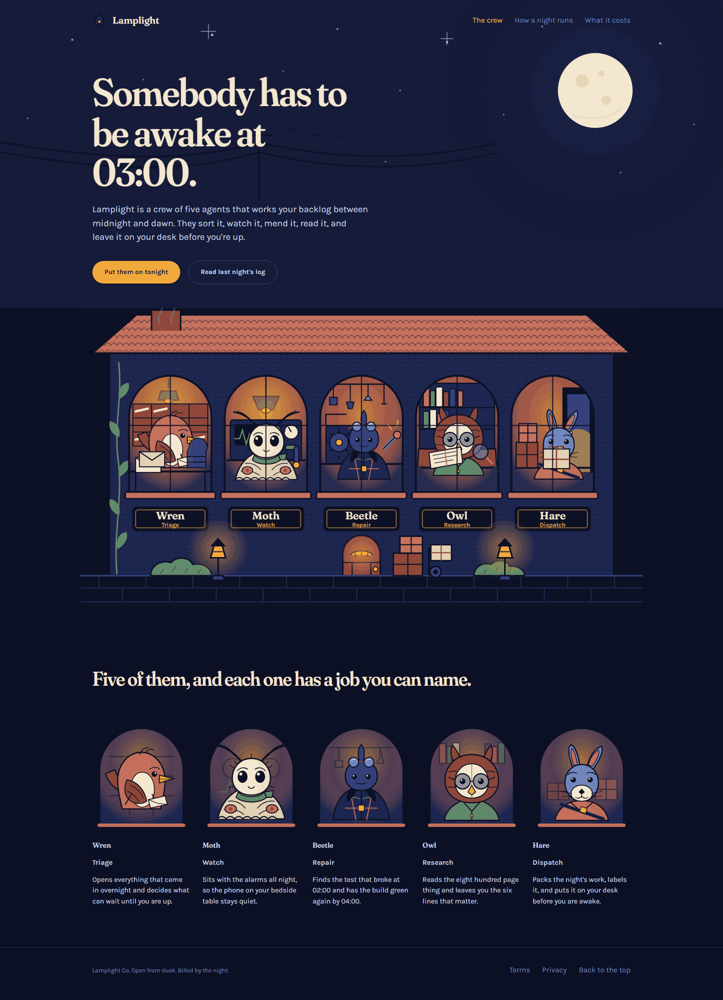
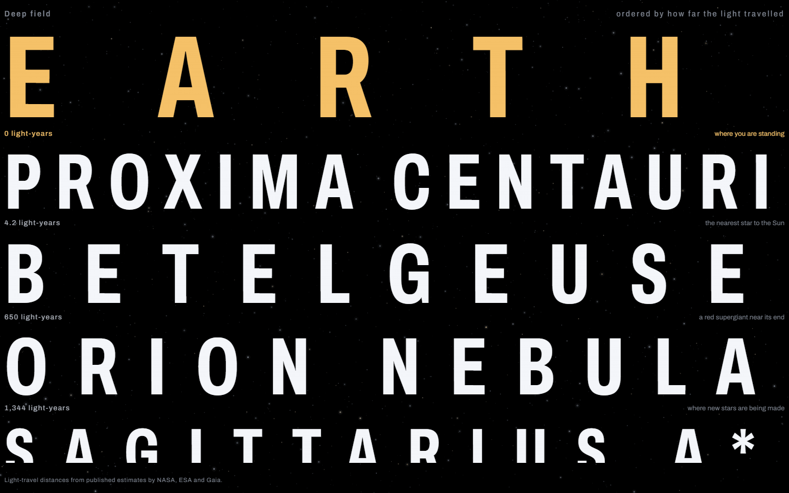

# vitruvian-design

A Claude Code skill that keeps an agent's interfaces from reading as AI-generated — design
decisions written into the project once, and counts in place of eyeballing, so a review comes
back as a repair list rather than an opinion.

Ask an agent for a screen with nothing specified and the defaults arrive: a purple gradient on
the primary action, glass on every card — and a different look next session. The skill inside,
design-discipline, names those defaults in its anti-slop rule and counts them at zero; the repo
is named for Vitruvius — firmitas, utilitas, venustas — because good building has criteria, and
this one writes them down.



BLURT, one of the seven pages below — an onboarding screen built from one prompt, the prompt
under its entry.

## Try it

Needs Claude Code, with Anthropic's [frontend-design](https://github.com/anthropics/skills/tree/main/skills/frontend-design) skill installed beside this one.
That skill carries the judgment — palette, typefaces, the looks to avoid; this one the
declaration and the counts. Install both. The reference study needs a browser the agent can
drive — Claude in Chrome, for one; without one, `init` asks once whether to connect, and if
you go on without one, the study is recorded as not yet done and its count stays open.

```bash
git clone https://github.com/shumatsumonobu/vitruvian-design
cp -r vitruvian-design/skills/. ~/.claude/skills/
git clone --depth 1 https://github.com/anthropics/skills /tmp/anthropic-skills
cp -r /tmp/anthropic-skills/skills/frontend-design ~/.claude/skills/
```

A skill is a plain directory. Copy one in and it works — no plugin, no marketplace, no restart.

In a project, run `/design-discipline-init` once: it derives the design declaration from the
subject, shows it beside what the code carries, asks whether the values stand and where the
declaration should live, and writes it when you agree — `.design/declaration.md` by default.
Nothing in the code changes. On a product that already has screens, `fix` and `review` ask one
more question before changing anything: how far the repairs may go.
[What it asks you](#what-it-asks-you) has the three questions and their answers. Then build
with a `/goal` — Claude Code's built-in goal loop, not something this repo ships; every prompt
below starts `/goal using the design-discipline and frontend-design skills, build …`. The
shortest form, with the tail every prompt below shares:

```
/goal using the design-discipline and frontend-design skills, build a landing page for a
fictional bakery. One theme only. Run init first; the derived declaration and its default
.design/ home have my agreement in advance. Done when the screen renders and the applicable
design-discipline inspection counts all pass, or stop after 15 turns
```

[Install](#install) has the per-project variant and what the five directories are.

## Seven pages, one prompt each

Each page below came out of this repo's skill, design-discipline, with Anthropic's
frontend-design beside it, in a fresh directory, from a single `/goal`. No hand edits: each
page in [gallery/](gallery/) is byte for byte what its run wrote. Each prompt names the
mechanics of the look it wants and forbids the failures earlier runs showed; the prompts, and
how they were arrived at, are in [gallery/README.md](gallery/README.md). `init` in a prompt is
`/design-discipline-init`; the inspection counts are lines like `Radius values outside the
declared scale: 0`. GitHub shows a page's source; clone the repo and open the file to see it
run. The prompt sits under each image.

### BLURT

An onboarding screen for a sticker app: forty-eight die-cut stickers, each a thing
with a face and a word, bursting from one glass marble over a noon sky.
[gallery/blurt.html](gallery/blurt.html)


The entrance was verified against a recording, its frame rate read off a sampler rather than
judged: a median of 59.9 frames a second, held with the CPU throttled and an occasional long
frame, and the record — the run's `.design/record.md` — draws its floor there. BLURT's prompt
differs from the other six in its tail: it also asks for the recording, and allows more turns.

<details><summary>The prompt</summary>

```text
/goal using the design-discipline and frontend-design skills, build an onboarding welcome
screen for a fictional sticker app. Its one job is to stun as a single image in a gallery — a
stranger scrolling past must stop — and then to play like a little show on load. The
mechanics of this kind of beauty: stickers that read as stickers — each a die-cut shape with
a white kiss-cut border, matte printed-paper texture, one shared light, a slight curl at one
edge; the subjects one artist's set of everyday things with faces, foods, and handwritten
one-word speech bubbles, forty or more, every one a character; the composition is the burst
itself — densest around a chrome balloon-letter logotype at the centre and thinning toward
the edges — over a vivid noon sky with one soft cloud mass behind the logotype to hold the
centre; and one glass orb as the single control, this product's own button. Entrance
choreography of roughly three seconds, staged like theater: the orb sinks in slowly from the
foreground, hangs for a beat of anticipation, then slams the centre with an exaggerated squash;
the stickers launch from the impact in three or four waves, each wave with its own direction
and character, decelerating floatily and settling with a strong springy overshoot and a slight
spin; once everything lands, the stickers keep an almost imperceptible idle drift so the board
feels alive. Arriving by opacity alone is a failure; every sticker must travel. The beauty is
functional: the stickers are what the app makes, and the burst is what sending one feels like.
Forbidden: bare geometric primitives — plain spheres, stars, hearts, crosses; glossy 3D blobs
with no paper edge; an even wallpaper spread with no focal mass; a flat gradient sky; a glass
orb that quotes someone else's interface. Record the long duration, the overshoot, and the idle
drift as declared exceptions; cross-fade under reduce-motion. One theme only, the one that
serves this product best — no light/dark pair, no theme control, no following the system
setting. Before calling it done, put your hero capture beside the strongest reference you
studied, write three ways yours is weaker, and fix the two that matter most at the size it will
be seen — a single image about 840 px wide. Single self-contained index.html, no build step;
a webfont loaded by link is fine. Run init first; the derived declaration and its default
.design/ home have my agreement in advance. Done when the screen renders, the entrance is
verified against a recording with the frame rate read off a measurement, and the applicable
design-discipline inspection counts all pass, or stop after 20 turns
```

</details>

### Quire

A product-launch hero for an e-ink tablet: one serif line, one device drawn in CSS
with a page of a book on its screen, and nothing else. [gallery/quire.html](gallery/quire.html)



<details><summary>The prompt</summary>

```text
/goal using the design-discipline and frontend-design skills, build a product-launch hero for a
fictional minimalist e-ink tablet. Its one job is to stun as a single image in a gallery — a
stranger scrolling past must stop. The mechanics of this kind of beauty: a serif headline at a
scale that owns the frame, one product render so finely drawn it looks photographed — real
material, real shadow, a beautiful page of a book on its screen — and white space staged like
a cathedral around exactly two objects. Nothing else on the page. The beauty is functional: the
page on the screen is the product doing its one job. Forbidden: a product that reads as a flat
rounded rectangle; timid type. One theme only, the one that serves this product best — no
light/dark pair, no theme control, no following the system setting. Before calling it done, put
your hero capture beside the strongest reference you studied, write three ways yours is weaker,
and fix the two that matter most at the size it will be seen — a single image about 840 px
wide. Single self-contained index.html, no build step; a webfont loaded by link is fine. Run
init first; the derived declaration and its default .design/ home have my agreement in advance.
Done when the screen renders and the applicable design-discipline inspection counts all pass,
or stop after 15 turns
```

</details>

### Asterism

A landing hero for a collective-knowledge platform: thousands of hard
canvas-drawn points clustered into constellations, each cluster labelled with a field of
knowledge. [gallery/asterism.html](gallery/asterism.html)



<details><summary>The prompt</summary>

```text
/goal using the design-discipline and frontend-design skills, build a landing hero for a
fictional collective-knowledge platform. Its one job is to stun as a single image in a gallery
— a stranger scrolling past must stop. The mechanics of this kind of beauty: thousands of
small, hard, crisp canvas-drawn light-cores clustered into constellations on a deep navy ground
rather than pure black — sharpness is what reads as light; softness reads as dirt — big
soft glows reserved for a dozen hero stars at most, three luminous hues, and each cluster
carrying a small quiet label naming a field of knowledge. One line of copy, one action. The
beauty is functional: every point is one note somebody kept, every cluster is a field the
community built, and the sky is what they know together. Forbidden: large blurry sprite blobs;
a murky mid-field; forcing the sky into any silhouette — the clusters make their own
geography. One theme only, the one that serves this product best — no light/dark pair, no
theme control, no following the system setting. Before calling it done, put your hero capture
beside the strongest reference you studied, write three ways yours is weaker, and fix the two
that matter most at the size it will be seen — a single image about 840 px wide. Single
self-contained index.html, no build step; a webfont loaded by link is fine. Run init first; the
derived declaration and its default .design/ home have my agreement in advance. Done when the
screen renders and the applicable design-discipline inspection counts all pass, or stop after
15 turns
```

</details>

### Dispatch

A landing page for an email API: layered near-blacks, one neon hue on the line of
code that sends, its light pooling on the floor beneath the card.
[gallery/dispatch.html](gallery/dispatch.html)



Its record names three ways the page was weaker than the strongest reference it studied — the
neon tinted rather than glowed, the reflection read as a rendering artifact, the blacks were
flat — and the review fixed the two that mattered at the size it is seen; the third is in the
table below.

<details><summary>The prompt</summary>

```text
/goal using the design-discipline and frontend-design skills, build a landing page for a
fictional email API for developers. Its one job is to stun as a single image in a gallery — a
stranger scrolling past must stop. The mechanics of this kind of beauty: blacks with depth —
layered near-blacks that read as velvet, never one flat #000 — one neon hue that genuinely
glows, with bloom and a reflection pooling on the surface beneath it, and a code block lit like
the only prop on a dark stage. Everything that is not the neon or the code sits barely above
black. The beauty is functional: the code shows the API doing its one job — sending an email
— and the neon marks the line that does it. Forbidden: a second accent hue; flat darkness; a
code block that reads as a grey box. One theme only, the one that serves this product best —
no light/dark pair, no theme control, no following the system setting. Before calling it done,
put your hero capture beside the strongest reference you studied, write three ways yours is
weaker, and fix the two that matter most at the size it will be seen — a single image about
840 px wide. Single self-contained index.html, no build step; a webfont loaded by link is fine.
Run init first; the derived declaration and its default .design/ home have my agreement in
advance. Done when the screen renders and the applicable design-discipline inspection counts
all pass, or stop after 15 turns
```

</details>

### The Roast Ledger

A sales dashboard for a coffee roaster set as a printed broadsheet:
poster-scale serif numerals, charts drawn as hairline engravings.
[gallery/roast-ledger.html](gallery/roast-ledger.html)



<details><summary>The prompt</summary>

```text
/goal using the design-discipline and frontend-design skills, build a sales-analytics dashboard
for a fictional specialty coffee roaster. Its one job is to stun as a single image in a gallery
— a stranger scrolling past must stop. The mechanics of this kind of beauty: it reads as a
beautifully printed broadsheet — warm paper ground, serif numerals so large they are the
poster, charts drawn as fine engravings in hairline ink strokes with nothing that looks like a
chart library, and margins generous enough to feel expensive. The beauty is functional: every
chart stays honestly readable — engraving is how the data dresses, never what replaces it.
Forbidden: grey dashboard chrome; default chart styling; small timid numbers. One theme only,
the one that serves this product best — no light/dark pair, no theme control, no following
the system setting. Before calling it done, put your hero capture beside the strongest
reference you studied, write three ways yours is weaker, and fix the two that matter most at
the size it will be seen — a single image about 840 px wide. Single self-contained
index.html, no build step; a webfont loaded by link is fine. Run init first; the derived
declaration and its default .design/ home have my agreement in advance. Done when the screen
renders and the applicable design-discipline inspection counts all pass, or stop after 15 turns
```

</details>

### Lamplight

A landing page for a night-shift crew of five agents: one illustrated house with
a lit window per agent, all in one hand, all inline SVG.
[gallery/lamplight.html](gallery/lamplight.html)



<details><summary>The prompt</summary>

```text
/goal using the design-discipline and frontend-design skills, build a landing page for a
fictional team of AI agents. Its one job is to stun as a single image in a gallery — a
stranger scrolling past must stop. The mechanics of this kind of beauty: a fully illustrated
world in one commissioned hand — a row of characterful agent portraits, each distinct but
unmistakably one artist's set, drawn scenery carrying the whole page, the interface furniture
almost disappearing into the illustration. All artwork as inline SVG, one declared style system
governing every drawing. The beauty is functional: each portrait is an agent with a nameable
job, and the scenery shows that work being done. Forbidden: clip-art mismatch between drawings;
a decorated page instead of an illustrated world; portraits that read as circles with initials.
One theme only, the one that serves this product best — no light/dark pair, no theme control,
no following the system setting. Before calling it done, put your hero capture beside the
strongest reference you studied, write three ways yours is weaker, and fix the two that matter
most at the size it will be seen — a single image about 840 px wide. Single self-contained
index.html, no build step; a webfont loaded by link is fine. Run init first; the derived
declaration and its default .design/ home have my agreement in advance. Done when the screen
renders and the applicable design-discipline inspection counts all pass, or stop after 15 turns
```

</details>

### Deep field

A typographic poster mapping deep space: names letter-spaced edge to edge,
ordered by how far their light travelled, over a slow starfield.
[gallery/deep-field.html](gallery/deep-field.html)



<details><summary>The prompt</summary>

```text
/goal using the design-discipline and frontend-design skills, build a typographic poster-page
mapping deep space. Its one job is to stun as a single image in a gallery — a stranger
scrolling past must stop. The mechanics of this kind of beauty: enormous display type,
letter-spaced until the words themselves become the map, running edge to edge of the frame —
scale so aggressive it feels like standing under it — over a living starfield that stays
behind the type. Nothing but typography, and typography is enough. The beauty is functional:
the letters map something real — names and distances a reader can actually read. Forbidden:
type that fits comfortably; decoration competing with the letters; a starfield that upstages
the words. One theme only, the one that serves this product best — no light/dark pair, no
theme control, no following the system setting. Before calling it done, put your hero capture
beside the strongest reference you studied, write three ways yours is weaker, and fix the two
that matter most at the size it will be seen — a single image about 840 px wide. Single
self-contained index.html, no build step; a webfont loaded by link is fine. Run init first; the
derived declaration and its default .design/ home have my agreement in advance. Done when the
screen renders and the applicable design-discipline inspection counts all pass, or stop after
15 turns
```

</details>

## What the runs left open

No record states whether its run ended on the done condition or on the turn cap. What each run
left open is the measure of how far it got, and it is in the run's record — the
`.design/record.md` written beside its declaration, outside this repo. The table carries what
the records mark as not run, not verified, or not fixed. What a row does not list, this README
does not vouch for: the table is a reading of each record, made when this README was written.
Every run named three ways its page fell short of its reference and fixed two; where a row
names a third weakness, it is the one left.

| Page | Left open |
|---|---|
| BLURT | Per-sticker contact-shadow variation, the third weakness against its reference; the frame-rate floor under CPU throttling, recorded rather than engineered around |
| Quire | The screen-reader walk; the third weakness against its reference — the two masses sharing no ground — closed at the ground plane, a residual of perspective left, recorded rather than repaired |
| Asterism | The frame rate, judged rather than measured; the third weakness against its reference — the scale range of its geography; two more items recorded rather than repaired: on narrow screens the labels crowd, none overlapping; and the action goes nowhere, since nothing exists past this screen |
| Dispatch | The screen-reader walk; the keyboard walk; the third weakness against its reference — the upper third of the frame still a flat field — not fixed |
| The Roast Ledger | The screen-reader walk; the states counts; the list of every string on the screen; the render with webfonts blocked; the third weakness against its reference — charts floating short of their column edges — not fixed |
| Lamplight | The screen-reader walk; the keyboard walk; the contrast ratios; the list of every string on the screen; the render with webfonts blocked; the artwork at four hundred percent; the three stranger walks; the reference study, which reached no reference |
| Deep field | The screen-reader walk; the keyboard walk; the motion recording and its frame-rate reading; the third weakness against its reference — every line ending on the same two edges — not fixed |

The pages ship with those open. The look on these pages is what their prompts ask for; what the
skill adds is the declaration, the counts, and the record this table is read from. No page here
was built without the skill, so the seven show what the skill produced, not what the same
prompt gives without it.

## What counts as right

Two tiers:

| Tier | Comes from | Lives in |
|---|---|---|
| **The numbers** — fixed | Adopted as stated from the documents named under Where the rules stand, attributed in NOTICE. The rest are this skill's own defaults; a project may override any of them in its declaration | The provenance table in [NOTICE](skills/design-discipline/NOTICE) |
| **The look** — per product | No house style. Chosen from the subject, after studying shipped winners and the platform vendors' own originals — Apple's first when the work should feel like Apple's | The project's `.design/declaration.md`, written once and read by every later session |

## design-discipline

Design discipline for building a screen and for reviewing one that already exists.
Platform-independent: the same rules apply to a native app and to a web app, and anything that
differs between them sits in a `Platform notes` section at the end of each rule file.
[Its own README](skills/design-discipline/README.md) is the operating reference once it is
installed.

### Install

The block under Try it installs for every project. For one project only, run this from that
project's root instead, and add frontend-design the same way:

```bash
mkdir -p .claude/skills && cp -r /path/to/vitruvian-design/skills/. .claude/skills/
```

Either lands five directories — the skill, and its four entries, which are commands in the `/`
menu:

```text
~/.claude/skills/   or   .claude/skills/
    design-discipline/           SKILL.md, README.md, NOTICE, and rules/ —
                                 tokens, layout, anti-slop, states, navigation,
                                 motion, copy, forms, assets, a11y, review
    design-discipline-init/      the declaration: derive, agree, write — once per project
    design-discipline-review/    improve an existing screen, from named deficits
    design-discipline-inspect/   run every applicable Inspection — the counts and checks in
                                 each rule file — and return the repair list
    design-discipline-fix/       work a repair list down to empty, at most five per pass
```

The skill fires on its own when the work is about a screen; to make that deterministic rather
than matched, give the project's `CLAUDE.md` one line:

```markdown
When building, restyling, auditing, or reviewing a screen, follow the design-discipline skill.
```

The skill directory follows the [Agent Skills](https://agentskills.io) format; the four
entries are Claude Code commands, and Claude Code is the only agent its author has run any of
it in.

### What the rules hold

Eleven rule files, each carrying an Inspection — counts that return a number, and checks
answered in a sentence:

| File | Owns |
|---|---|
| [tokens](skills/design-discipline/rules/tokens.md) | The declaration: 4 to 6 named colors with one accent, one grey family, one or two typefaces with stated roles, a type scale, one spacing unit, radius and elevation scales, springs and easing, formats, voice. Derived from the subject; where code exists it is read beside the derivation and every difference reported, never adopted |
| [layout](skills/design-discipline/rules/layout.md) | Shared edges shared exactly, the gap inside a group smaller than the gap around it, optical centering, one primary control per screen, every region declaring how it narrows |
| [anti-slop](skills/design-discipline/rules/anti-slop.md) | The unprompted defaults — the purple gradient, glass on every card, mesh gradients, confetti — named and counted: color literals, off-scale radii, undeclared shadows, emoji in chrome, all at zero |
| [states](skills/design-discipline/rules/states.md) | Five states per screen, forced on the running screen and captured, never reasoned from the source; the response thresholds; long content at three times the expected length; the four session interruptions |
| [navigation](skills/design-discipline/rules/navigation.md) | Stack against replace, one-way doors past sign-in and checkout, sheets that outgrew their container, no rebuilt platform controls, deep links landing with history beneath them |
| [motion](skills/design-discipline/rules/motion.md) | A frequency gate before any curve; springs for fingers, ease-outs for timers, overshoot for thrown things only; verified against a recording, frame rate measured rather than judged |
| [copy](skills/design-discipline/rules/copy.md) | One label per intent, banned strings, numbers and dates out of a locale formatter, no layout hanging off a string's length |
| [forms](skills/design-discipline/rules/forms.md) | Labels above fields that stay, input method and autofill declared per field, validation that waits until the reader is done, the raised keyboard never covering the field being typed into |
| [assets](skills/design-discipline/rules/assets.md) | A style system before the first asset, generated or drawn in code; every edge inspected at four hundred percent, a product icon still legible at 60 pixels |
| [a11y](skills/design-discipline/rules/a11y.md) | The floor no exception lifts: names on everything operable, images described or hidden, color never the sole carrier, focus in and back out, keyboard parity, results announced — verified by two walks |
| [review](skills/design-discipline/rules/review.md) | What better means: three deficits named before gathering, at most five repairs per pass, a comparison against the strongest shipped screen solving the same problem |

### What the skill asks a session to do

1. Study before drawing: shipped work and the platform vendor's own materials first, seen in a
   browser — five references, a written note that none exist, or, with no browser to drive,
   the study recorded as not yet done and its count left open.
2. `init` derives the declaration from the subject, reads the code beside it without adopting
   a value, shows both, and writes it once, with agreement.
3. Build, opening one rule file per decision as it arrives — nothing read up front.
4. Before done: every state forced and captured, every back path walked, the whole flow recorded
   in one take, a cold start and a keystroke timed, the two accessibility walks, and the counts —
   a count that misses is a repair to make, not a point to argue.
5. The screen is walked three times as a stranger: the happy path, the skeptic path that declines
   everything optional, and the abuse path: bad input, no connection, interrupted mid-flow, every
   control pressed twice, and back from everywhere.

The seven runs above did not do all of these; what each record marks as not run is in the table
under What the runs left open.

### What it asks you

Three questions, each asked once.

1. **A browser, when the session has none.** The reference study needs pixels. `init` asks
   whether one can be connected; going on without one records the study as not yet done, and
   its count stays open until it is done.
2. **The declaration.** `init` shows the derived values beside what the code carries and asks
   whether they stand and where the file should live — `.design/declaration.md` by default,
   or a section inside a design document you already keep. A value the code carries is kept by
   amending the declaration, not by `init` reading it in. A brief can answer this in advance;
   every prompt above does.
3. **How far the repairs may go**, on a product that already has screens, before `fix` or
   `review` change anything. Four answers, and the one given is written into the declaration
   so later passes do not ask again:
   - Keep the layout, recorded as *structure kept* — layout, artwork, and motion stay; color,
     type, spacing, states, copy, forms, and accessibility are repaired
   - Change anything, recorded as *everything may change* — the whole repair list, and
     `review`'s rebuild
   - Report only, recorded as *report only* — nothing changes; the list is written to the
     record
   - Keep these, recorded as *kept: …* — name what must stay, as anyone would see it on the
     screen; everything else may change

   Accessibility repairs are applied under every answer but report only. A fresh build is
   never asked. A brief can answer this in advance too.

### Where the rules stand, and what was left out

The rules stand on the platform vendors' own documents — Apple's Human Interface Guidelines,
Material Design, the platforms' developer documentation — and on WCAG 2.2. What a document
states is taken as stated and attributed in NOTICE; the rest are this skill's own defaults.
Each rule is the platform-independent decision, restated so a reviewer can count it.

**Scope is what the person using the screen receives.** Where application state lives, render
performance, asset production, and build configuration were deliberately left out. None of that
is unimportant; it belongs to a different skill.

## Contributing

[CONTRIBUTING.md](CONTRIBUTING.md): where things live, and how a change is synced, reviewed,
run, and committed.

## License

MIT

## Author

shumatsumonobu ([@shumatsumonobu](https://github.com/shumatsumonobu))
